# UCB-MLAI-Practical-Application-1

# Will the Customer Accept the Coupon?

## Overview:
In this first practical application assignment of the program, you will seek to answer the question, “Will a customer accept the coupon?” The goal of this project is to use what you know about visualizations and probability distributions to distinguish between customers who accepted a driving coupon versus those that did not. Use the Practical Application 1 Jupyter Notebook Links to an external site.to complete this assignment.

## Data:
This data comes to us from the UCI Machine Learning repository and was collected via a survey on Amazon Mechanical Turk. The survey describes different driving scenarios, including the destination, current time, weather, passenger, etc., and then asks people whether they will accept the coupon if they are the driver. Answers given that the users will drive there “right away” or “later before the coupon expires” are labeled as “Y = 1”, and answers “no, I do not want the coupon” are labeled as “Y = 0”. There are five different types of coupons—less expensive restaurants (under $20), coffee houses, carry out and take away, bars, and more expensive restaurants ($20–$50).

## Deliverables:
Detailed finding can be found in this Jupyter Notebook: [prompt.ipynb](https://github.com/jeremystairs/UCB-MLAI-Practical-Application-1/blob/main/prompt.ipynb)

Initial data: [data](https://github.com/jeremystairs/UCB-MLAI-Practical-Application-1/blob/main/data)

Images generated during analysis: [images](https://github.com/jeremystairs/UCB-MLAI-Practical-Application-1/blob/main/images)

## Independent Investigation

### Preparation

Time and Expiration column values were converted from strings to numberical values. Visit frequency column values were changed to more readable values. Visit frequency columns were renamed be more consistent with the other columns.

The `car` column was missing a value for over 99% of records. This column was dropped. 

### Focus

This investigation focuses on coupon types with a lower proportion of accepted coupons.

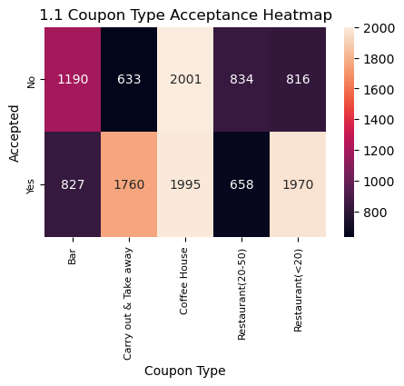

Bar coupons and expensive restaurants had the lowest accpetance rates.

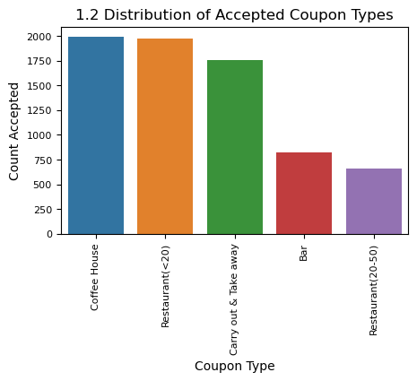

Coffee houses had the highest number of accepted coupons. However, condisdering all of the coffee house coupons offered, only about half of the coupons were accpted. We will further examine the accpetance of these coupon types.

### Analysis - Coffee House Coupons

We'll examine a series of SNS countplots to find catagory values with high acceptance rates.

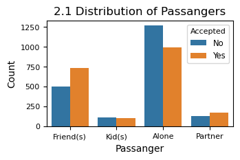 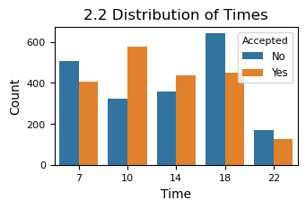

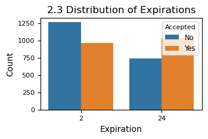 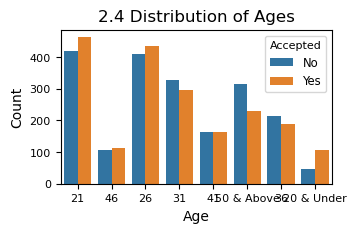

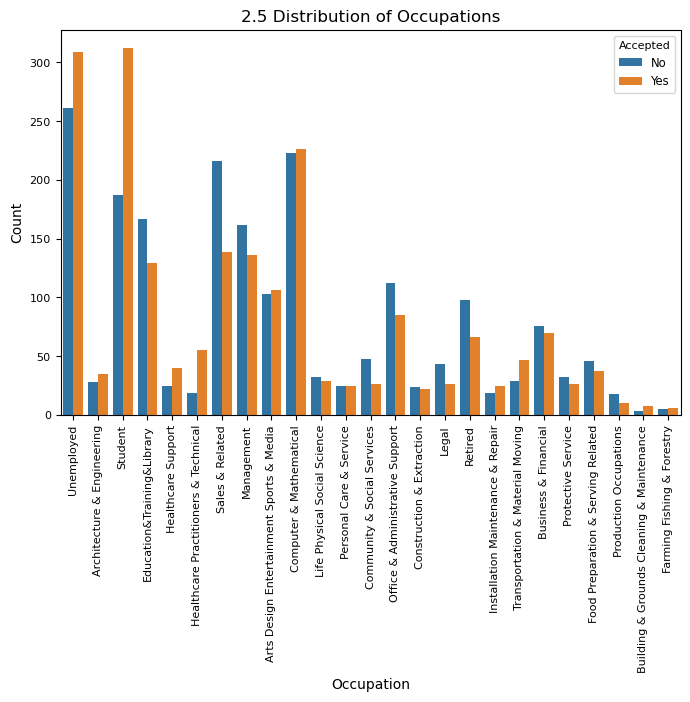

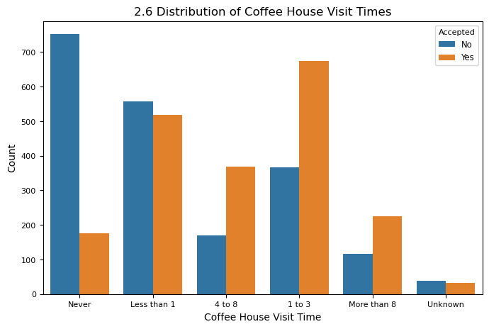

From the plots above, we can see there's a higher acceptance rates:
1. for drivers with friends as passangers. (plot 2.1)
2. in the late morning and afternoon. (plot 2.2)
3. for 1 day expirations over 2 hour expirations. (plot 2.3)
4. for drivers aged about 26 and under. (plot 2.4)
5. for students and those unemployed. (plot 2.5)
6. for drivers that visit coffee houses 1 or more times a month. (plot 2.6)

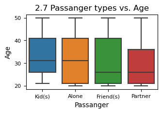 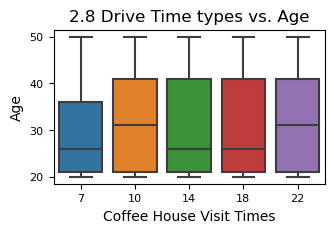

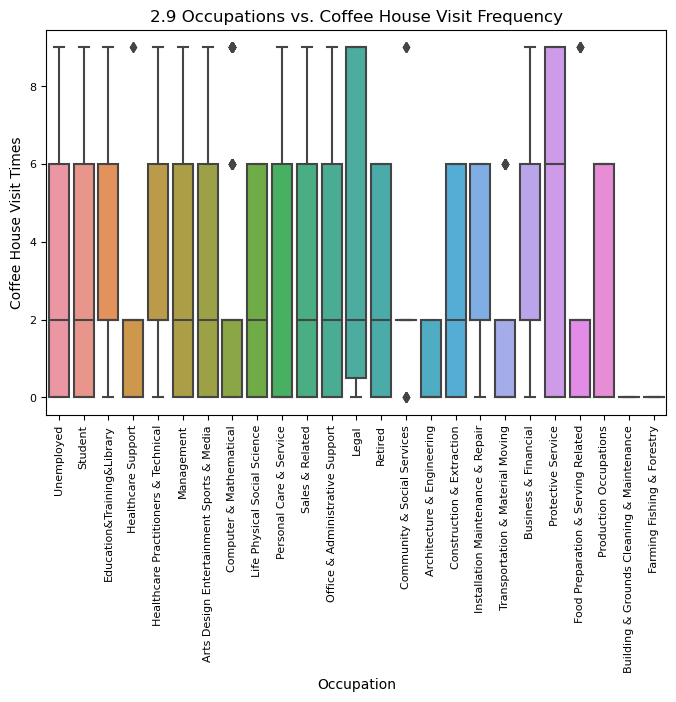

We can find relationships between those drivers that accepted coffee house coupons. Drivers with friends as passangers tend to be age about 25. Both of these groups were more likely to accept the coffee house coupon (plot 2.7). There's a similar relationship between drive time and age (plot 2.8).

Previously, we determined that those visiting coffee houses more than once a month were likely to accept coupons. Coffee house visits were higher among those with legal and protective service occupations.

### Analysis - Expensive Restaurant Coupons

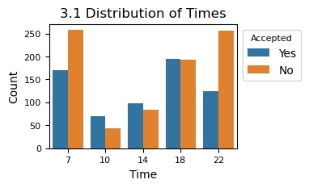 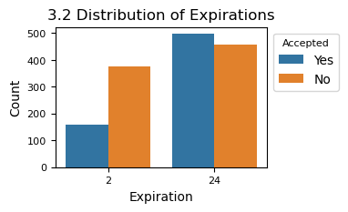

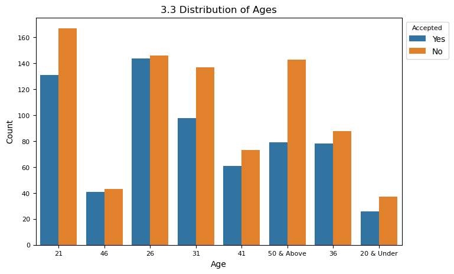

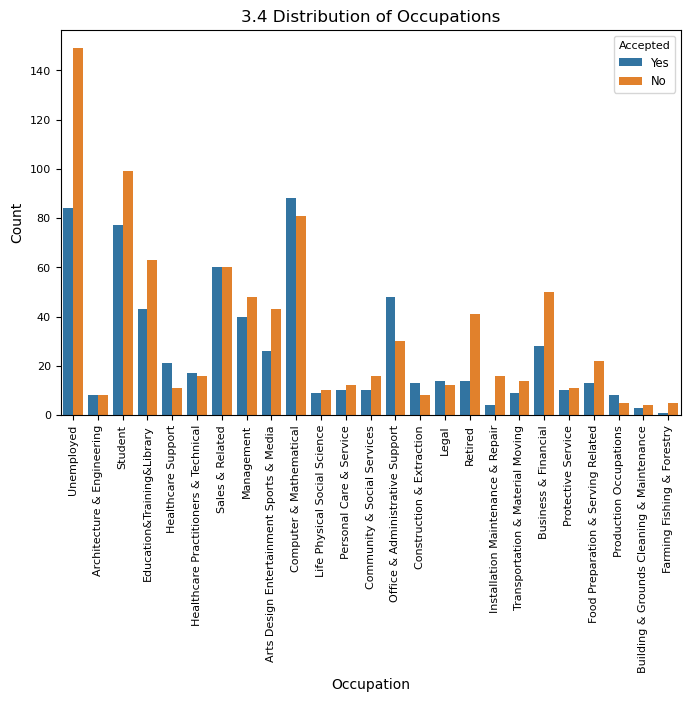

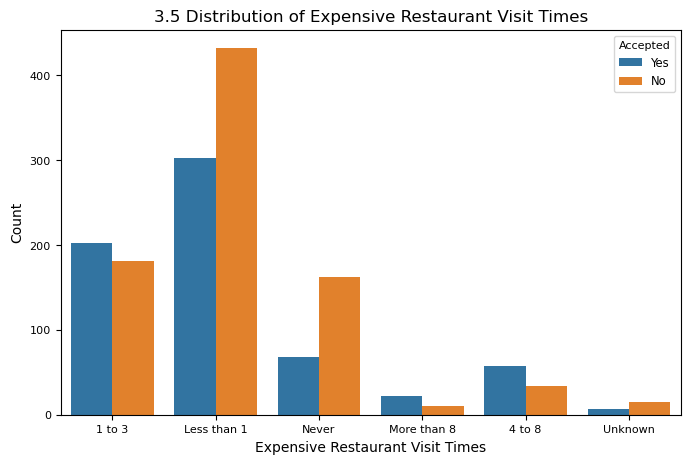

Acceptance for expensive restaurant coupons is relatively low. There are few catagorty values with high acceptance rates, but there are several where the acceptance rate is relatelively better:
1. for drivers with friends as passangers. (plot 3.1)
2. in the late morning and afternoon. (plot 3.2)
3. for 1 day expirations over 2 hour expirations. (plot 3.3)
4. for drivers aged about 26 and under. (plot 3.4)
5. for students and those unemployed. (plot 3.5)

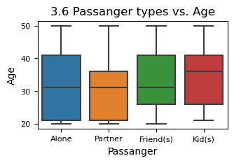

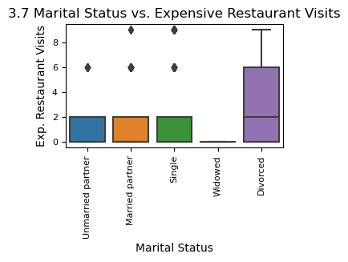

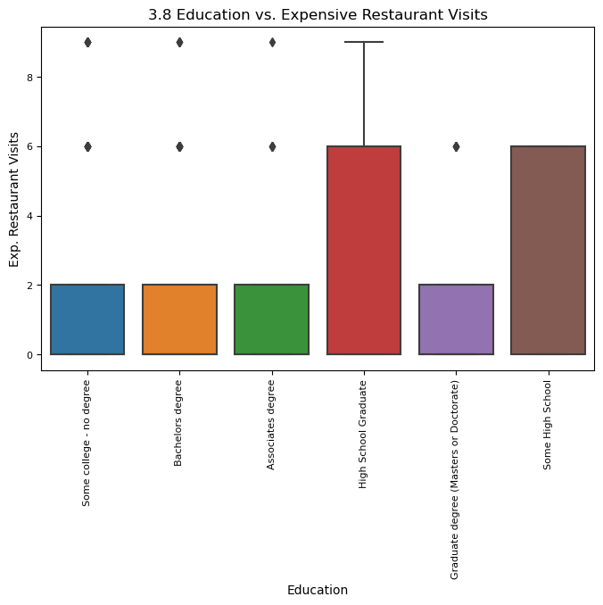

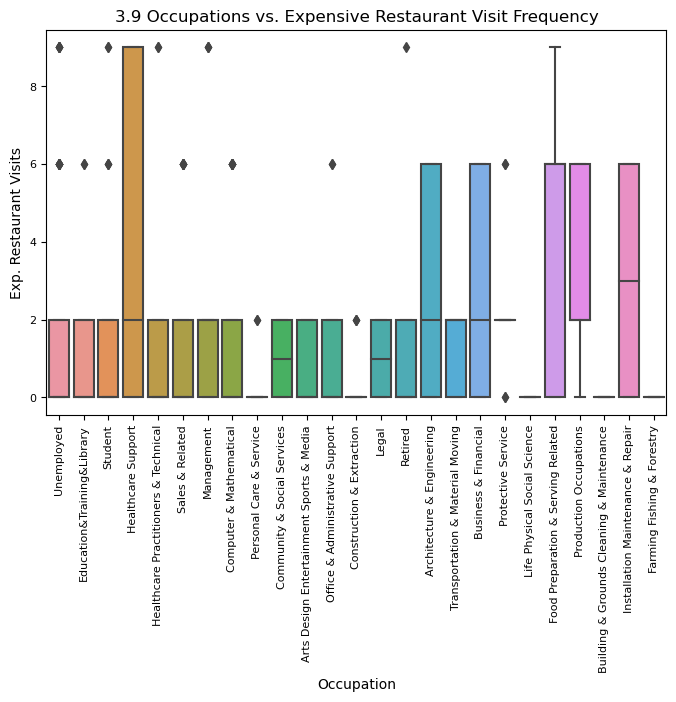

As with drivers that accepted coffee house coupons, we can find relationships between those drivers that accepted expensive restautant coupons. Drivers with friends as passangers tend to be age about 25. Both of these groups were more likely to accept the coffee house coupon (plot 3.6).

Expensive restaurant visits were more likely from several groups including the divorced (plot 3.7), high school or some highschool eduation, and occupations:
1. Healthcare Support
2. Achitecture and Engineering
3. Food Preparation and Service
4. Installation Maintenance and Repair
5. Farming, Fishing, and Forestry

### Recommendations

For both coffee houses and expensive restaurants, drivers were more likely to accept coupons that expired in a day rather than those that expired in 2 hours.

#### Coffee House Coupons

There is a relationship between drivers with friends as passangers, drivers at the age of about 25, and those driving in the late morning. Coffee house visits were higher among those with legal and protective service occupations. Coffee house coupons could be focused at these groups to maximize acceptance.

#### Expensive Restaurant Coupons

Among those that accepted the expensive restaurant coupons, there is a relationship between drivers 
with friends as passangers and drivers that at about the age of 25. Expensive restaurant visits were more likely for the divorced and drivers with high school or some high school eduation. Expensive restaurant coupons could be targeted at these groups to maximize accpetance.